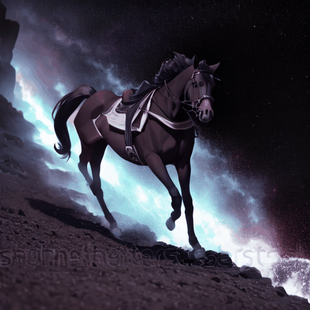
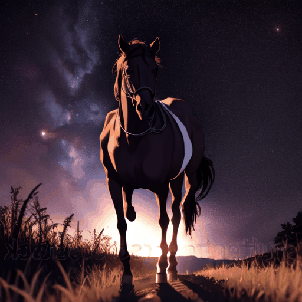
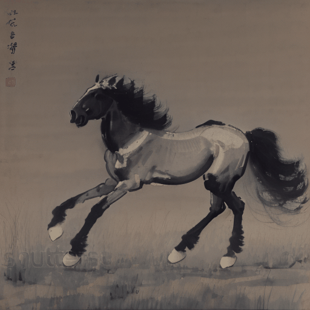
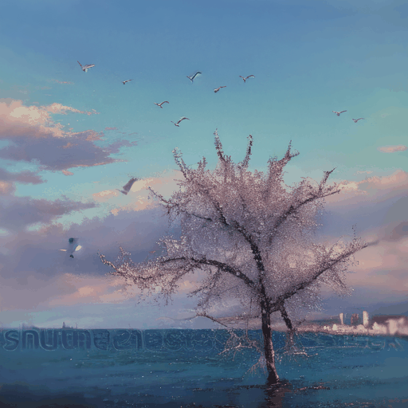
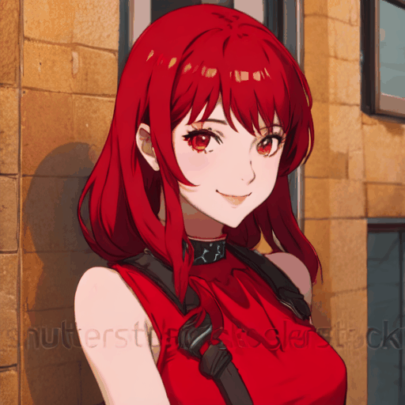
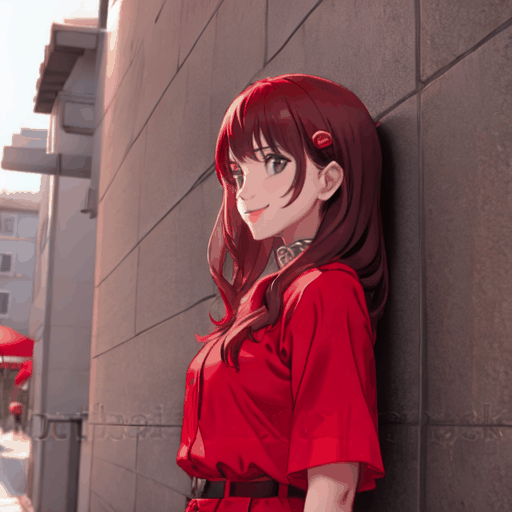
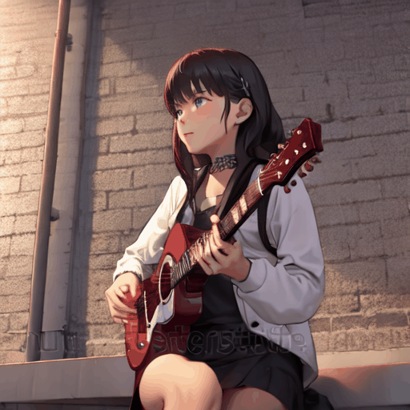

# Few-shot-based Video Generation via multimodal Fusion and Fourier Spliter

Weikang Zhong,
XiaYong Li,
Qiangying Huang,
Guowu Yuan,
Hao Wu*

*Corresponding Author

## Result

<table class="center">
<tr>
  <td style="text-align:center;" colspan="4"><b>Output Video</b></td>
</tr>
<tr>
  <td></td>
  <td></td> 
  <td></td>
  <td></td>  
</tr>
<tr>
  <td width=25% style="text-align:center;">"a horse is running in the universe"</td>
  <td width=25% style="text-align:center;">"a horse is running in the universe”</td>
  <td width=25% style="text-align:center;">"a horse is running in the universe"</td>
  <td width=25% style="text-align:center;">"a horse is running,traditional-chinese-painting"</td>
</tr>

<tr>
  <td></td>
  <td></td>
  <td></td>              
  <td></td>
</tr>
<tr>
  <td width=25% style="text-align:center;">"birds fly in the sunset"</td>
  <td width=25% style="text-align:center;">"many birds fly in the pink sky"</td>
  <td width=25% style="text-align:center;">"many birds fly,oil-painting"</td>
  <td width=25% style="text-align:center;">"many birds fly,oil-painting"</td>
</tr>

<tr>
  <td></td>
  <td></td>
  <td></td>              
  <td></td>
</tr>
<tr>
  <td width=25% style="text-align:center;">"a girl in red turns to smile"</td>
  <td width=25% style="text-align:center;">"a girl in red turns to smile"</td>
  <td width=25% style="text-align:center;">"a girl turns to smile, pixels style"</td>
  <td width=25% style="text-align:center;">"a girl turns to smile, pixels style"</td>
</tr>

<tr>
  <td></td>
  <td></td>
  <td></td>              
  <td></td>
</tr>
<tr>
  <td width=25% style="text-align:center;">"an old man is playing the guitar"</td>
  <td width=25% style="text-align:center;">"a girl is playing the guitar"</td>
  <td width=25% style="text-align:center;">"old man is playing the guitar,sketch"</td>
  <td width=25% style="text-align:center;">"a boy is playing the guitar,sketch"</td>
</tr>
</table>

## Updates
A huge thank you to everyone for your amazing support and interest in our project! We're working hard to get the demo and code ready for public release, and we can't wait to share it with you. While we don't have a release date yet, we promise we'll let you know as soon as we can. 
Thank you for your patience and for being part of this journey with us!  

## Contact Us
**Weikang Zhong**: [zwk1zmttk@gmail.com](mailto:zwk1zmttk@gmail.com)  
**Hao Wu**: [haowu_sise@ynu.edu.cn](mailto:haowu_sise@ynu.edu.cn)
